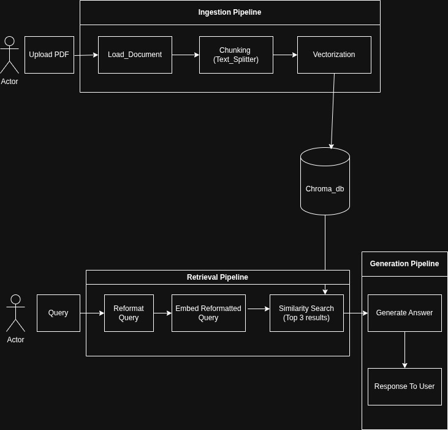
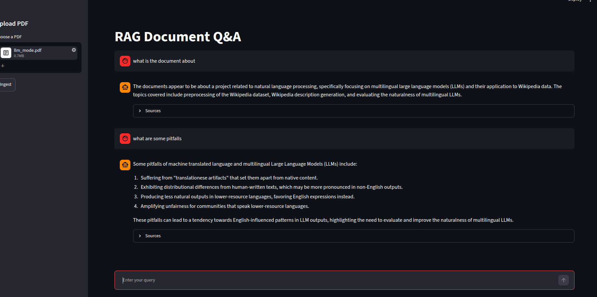

# RAG Document Q&A

A simple Retrieval-Augmented Generation (RAG) app that lets you upload a PDF and
ask questions about it. Instead of answering from general knowledge, the app
retrieves the most relevant passages from your document and uses them to generate
answers grounded strictly in the PDF's content — with the source chunks shown
alongside each answer.

Built with Streamlit, LangChain, Chroma (vector store), Google Gemini
(embeddings), and Groq (LLM).

## Running the App

### Prerequisites
- Python 3.10+
- API keys for **Groq** (text generation) and **Google Gemini** (embeddings)

### 1. Set up API keys
Create a file named `.env` in the project root with your keys:

```
GROQ_API_KEY=your_groq_key_here
GOOGLE_API_KEY=your_gemini_key_here
```

- Groq key: https://console.groq.com
- Gemini key: https://aistudio.google.com/apikey

### 2. Install dependencies

```bash
pip install streamlit python-dotenv langchain-core langchain-chroma \
  langchain-groq langchain-google-genai langchain-text-splitters \
  langchain-pymupdf4llm
```

### 3. Run the app
From inside the project folder:

```bash
streamlit run app.py
```

This opens the app in your browser at **http://localhost:8501**.

### 4. Use it
1. In the sidebar, upload a PDF and click **Ingest**.
2. Wait for the "Ingested into N chunks" confirmation.
3. Type a question in the box at the bottom.
4. The answer appears, grounded in your PDF, with an expandable **Sources** panel.

> **Note:** Each new upload replaces the previous document — the app rebuilds
> the vector store from scratch on every ingest.

## Architecture



The system has two pipelines that share a single Chroma vector store: an
ingestion pipeline (write path) that turns an uploaded PDF into searchable
vectors, and a retrieval + generation pipeline (read path) that answers questions
from those vectors.

## Ingestion Pipeline

The ingestion pipeline is the **write path** of the system. It runs once each
time a user uploads a PDF, and its only job is to turn that raw PDF into a
searchable vector store. No question-answering happens here — this is purely
preparation. It maps to the top row of the architecture diagram:
**Upload PDF → Load Documents → Chunking → Vectorization → Chroma_db.**

### Upload PDF

The user uploads a PDF through the app's file uploader. LangChain's document
loaders need an actual file path on disk to read from. Since the user is
uploading online, there's no such path — the file arrives as raw bytes in memory.
So we convert the upload to bytes and feed those into the pipeline instead, where
the next stage writes them to a temporary file the loader can read.

### Load_Documents

`PyMuPDF4LLMLoader` extracts text from the PDF into Document objects (one per page) with
source and page metadata. PyMuPDF4LLM is fast and produces clean, Markdown-style text
well-suited for LLM consumption, which is why it was chosen.

Its limitation is that it handles pure text well but does not reliably parse
complex structures like tables, which can come out flattened or misaligned.

Alternatives considered:
- **Docling** — stronger structured parsing with dedicated table and layout
  recognition, but it runs heavier ML-based layout models that significantly
  increase processing time and dependency footprint. That cost isn't justified
  for a predominantly text-based corpus.
- **Unstructured.io** — robust multi-format parsing with element/table detection,
  but it pulls in a large dependency stack and is slower per document.


### Chunking (Text_Splitter)

`RecursiveCharacterTextSplitter(chunk_size=1000, chunk_overlap=150)` splits the
loaded Documents into chunks of ~1000 characters with 150 characters of overlap.
It splits on a descending priority of separators (`\n\n` → `\n` → space →
character), only falling to a coarser separator when a segment still exceeds the
size limit, which keeps breaks on semantic boundaries rather than mid-token.
`split_documents` is used over `split_text` to preserve per-chunk metadata
(source, page) required for downstream citation.

Alternatives considered:
- **[Fixed-size / CharacterTextSplitter]**
- **[Semantic / token-based / Markdown-aware splitting]**

### Vectorization (Create_Embeddings)

`GoogleGenerativeAIEmbeddings(model="models/gemini-embedding-001")` is the
embedding function. `Chroma.from_documents(documents=chunks, embedding=...,
persist_directory="./chroma_db")` embeds each chunk's `page_content` and writes
the resulting vectors, the source text, and metadata into a Chroma collection
persisted to `./chroma_db`. The same model is reused at query time — embeddings
are only comparable within one model's space, so it's fixed across ingestion and
retrieval.

## Retrieval + Generation Pipeline

The bottom row of the diagram is the read path. It runs once per question and
turns a user query into an answer grounded in the ingested document. All of it
lives in `generate_q(query, chat_history)` in `retrieval_generation.py`. Flow:
**Query → Reformat Query → Embed Reformatted Query → Similarity Search → Generate
Answer → Response.**

### Query

The raw question from the user, plus the running `chat_history` (prior
question/answer turns in the session).

### Reformat Query

A standalone-question rewrite. Follow-up questions are often context-dependent —
"what about its limitations?" only makes sense given the previous turn. If
`chat_history` is non-empty, the query and history are sent to the LLM with an
instruction to rewrite the question into a self-contained, searchable form. On
the first turn (empty history) this step is skipped and the raw query is used as-is.

This matters because retrieval is about to embed the query and match it against
chunks by meaning — an unresolved "it" or "that" embeds poorly and retrieves the
wrong context. Resolving references first makes the search vector accurate.

### Embed Reformatted Query

The reformulated query is embedded with the same Gemini model used during
ingestion (`models/gemini-embedding-001`). This is mandatory: the query vector
and the stored chunk vectors must come from the same model to be comparable. The
embedding happens implicitly when the query is passed to the retriever.

### Similarity Search (Top 3)

`vectorstore.as_retriever(search_kwargs={"k": 3})` queries Chroma for the 3
chunks whose vectors are closest to the query vector (nearest-neighbour search by
vector distance). These are the passages most semantically relevant to the
question. Their text is concatenated into a context block, and because the chunks
carry their source/page metadata, that metadata rides along for citation.

### Generate Answer

The retrieved chunks are injected into a prompt template that instructs the LLM
to answer using only the provided context, and to say it doesn't have enough
information if the answer isn't there — this is what keeps responses grounded in
the document rather than the model's own knowledge. The prompt, system message,
and chat history are sent to the Groq LLM (`llama-3.3-70b-versatile`), which
produces the answer. The original question and the answer are appended to
`chat_history` so the next turn's Reformat step has them.

### Response

`generate_q` returns `(answer, docs)`. The app displays the answer and exposes
the retrieved chunks in a Sources panel (filename, page, snippet), giving the
user a traceable, grounded result.

## Streamlit (UI Layer)

Streamlit is the web framework that wraps the pipelines into a usable interface.
It's `app.py` — the only file that talks to the user. It owns no RAG logic itself;
it imports the ingestion and retrieval functions and wires them to UI widgets.

Streamlit's execution model is the key thing to understand: the entire script
reruns top-to-bottom on every user interaction — every button click, every query
submission, every widget change. There is no persistent server loop holding
state between interactions. This has two direct consequences in the code:

- **`st.session_state`** is how state survives reruns. Because plain variables
  reset on every rerun, anything that must persist — the chat history, the last
  answer — is stored in `st.session_state` rather than ordinary variables. This
  is why `generate_q` takes `chat_history` as an argument: the app holds the
  authoritative history in session state and passes it in, instead of relying on
  a module-level list that the rerun model would make unreliable.

- **Interactions are gated**, not automatic. Ingestion runs only inside
  `if uploaded and st.button("Ingest")` — not the moment a file is uploaded —
  because otherwise the rerun model would re-trigger expensive embedding work on
  unrelated UI events.

The interface itself is minimal: a sidebar `st.file_uploader` and Ingest button
for the write path, `st.chat_input` for questions, `st.write` for the answer, and
an `st.expander` showing retrieved sources with their filename, page, and snippet.
`st.spinner` wraps the slow calls (ingestion, generation) to give visual feedback
while the model runs.

## FAQ

**Q) What kind of PDF can I upload?**
Text-based PDFs — documents where the text is selectable/extractable (digitally
created PDFs, exported docs, etc.). Scanned PDFs or image-only PDFs won't work,
since there's no text layer to extract and OCR isn't supported. Tables and
complex layouts may not parse cleanly.

**Q) What size of PDF can I upload?**
There's no hard size limit enforced in the code, and Streamlit's uploader allows
up to 200 MB by default. The practical constraint is Gemini's embedding rate
limits: a larger PDF produces more chunks, and each chunk is a separate embedding
call, so big documents make many API calls in a short window and can hit the
free-tier rate limit (returning a 429 / RESOURCE_EXHAUSTED error). The exact
embedding rate limit depends on your project's usage tier and is viewable in
Google AI Studio. For large documents, ingestion may need to be throttled or run
on a higher tier.

**Q) How many documents can I query at once?**
One. Each ingest deletes the existing `./chroma_db` and rebuilds it from only the
newly uploaded PDF, so the vector store always holds a single document. Uploading
a new file replaces the previous one. Querying across multiple documents would
require removing the wipe step in the ingest block and adding per-document
metadata so retrieval could filter or span sources.

## Screenshots



